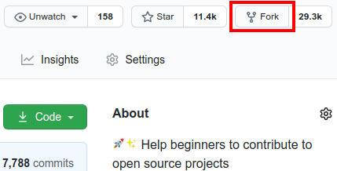
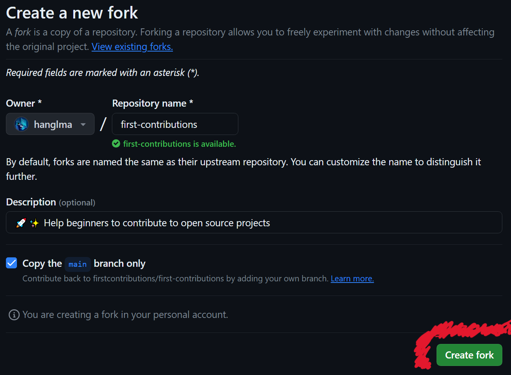
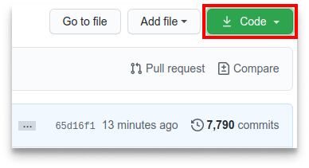
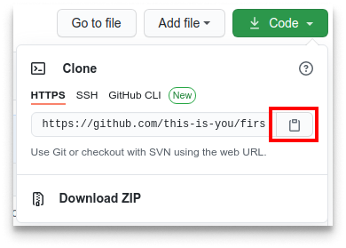
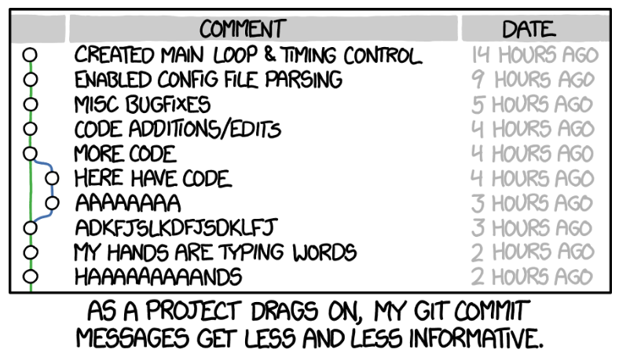
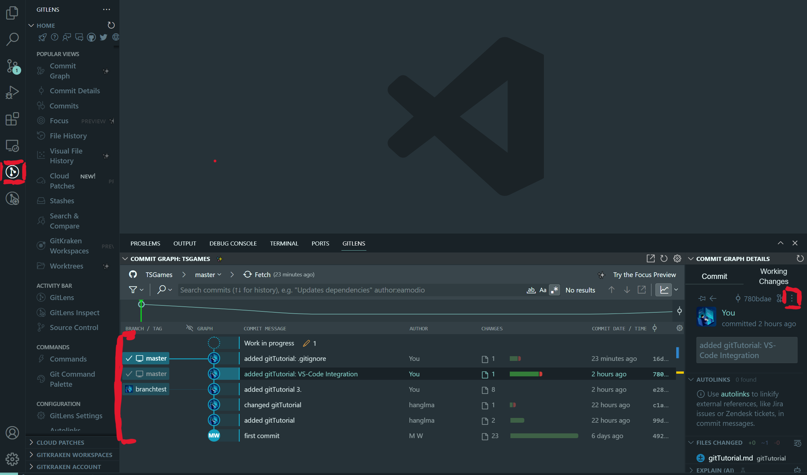
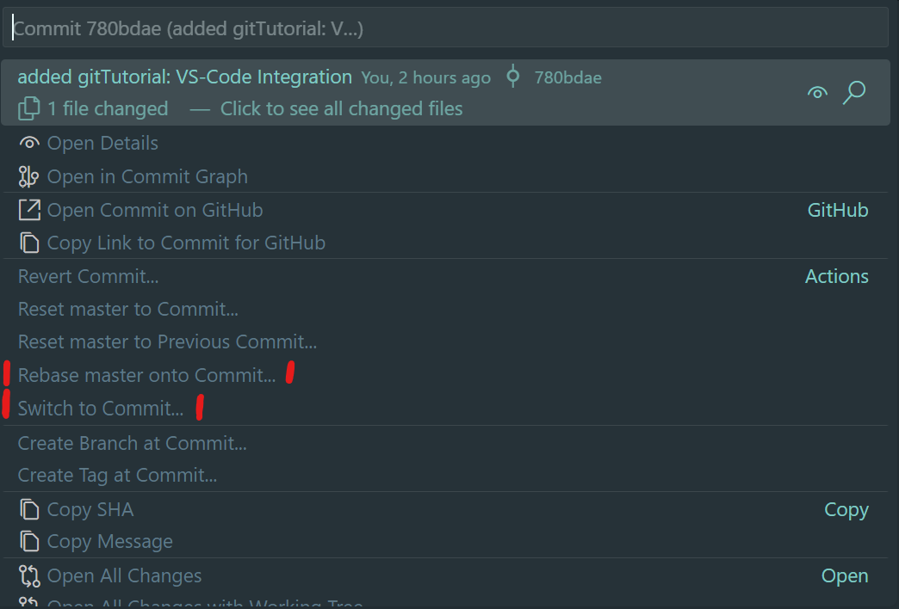

# Versionsverwaltung der Zukunft: Beispiele mit git

## 1. Installation und Einrichtung

### Installation der Programme

Als erstes muss *git* natürlich installiert werden. Dafür müssen die Download-Files von https://git-scm.com/download/win heruntergeladen werden.
Der Link führt zum Download für die Windows Version von *git*, hier kann die neuste Version herunterladen.

Um nun *git* zu installieren muss man die gerade heruntergeladene .exe Datei die ausführen. Nun wird dir ein Dialogfenster angezeigt, das Optionen zur Installation von *git* enthält. Die Voreinstellungen passen so wie sie sind, d.h. es kann einfach durch geklickt werden.

Natürchlich braucht man auch einen Code-Editor. Im folgenden wird Visual Studio Code genutzt, jedoch is in diesem Tutorial leider keine Zeit für ein vollständiges Tutorial von VS-Code. Hier ist ein Video, dass trotzdem nützlich sein könnte 😉 https://www.youtube.com/watch?v=r5jNl-IOSZg 

### Anmeldung bei gitHub oder gitLab

Um mit *git* Repositories zu verwalten braucht man natürlich auch Repositories. Hierfür muss ein gitHub oder gitLab Account erstellt werden. Beide Websites funktionieren gut jedoch ist gitHub die größere Plattform was heißt, dass es dort mehr Projekt von Anderen zufinden gibt.

Für die Registrierung folge bitte diesem Link: https://github.com (Nutzerdaten merken!!!)

### Einrichtung Username & E-Mail

Um nun das *git* des Computers mit gitHub zu verbinden muss die *.gitconfig-Datei* bearbeitet werden. Dies geschiet mit dem Befehl *git config*.

```
# Befehl zum setzten des Nutzernamen
$ git config --global user.name hanspeter

# Befehl zum setzen der E-Mail
$ git config --global user.email hans@peter.de
```

Die ersten Schritte sind geschafft 😁 *git* ist jetzt berteit für das erste Projekt. Aber wie und welche Befehle kannst man dabei gebrauchen kann, dass kommt im nächsten Abschnitt.

## 2. grundlegende Begriffe und Befehle + erstes Projekt

Um die Grundlegenden Begriffe und Befehle zu lernen kann man ein Projekt namens *first-contributions*. Hier wird einem beigebracht wie man mit Menschen aus der ganzen Welt zusammenarbeiten kannst.

Hier ein Link für dieses Projekt: https://github.com/firstcontributions/first-contributions/tree/main 

### ein Repository *"forken"*

Als erstes muss man das Repository *"forken"* damit Änderungen daran vorgenommen werden können. Hierzu muss auf den Knopf namens Fork geklickt werden. 



Als nächstes auf Create Fork klicken. (alle anderen Einstellungen passen so wie sie sind) Dies sollte nun eine Kopie des Repositorys im persöhnlichen Account erstellen.



### das Projekt auf den eigenen Computer laden (*git clone*)

Jetzt wird das vorher *"geforkte"* Repository auf den Computer *geklont*. Dazu öffnet man das Repository in seinem Account und klickt auf den Knopf "Code".



Nun öffnet sich ein Fenster mit einre URL, diese muss kopiert werden.



Um das Repositroy zu klonen gibt man jetzt den Befehl *git clone* gefolgt von der gerade kopierten URL.

Dieser Befehl muss in *Commandline* oder *Cmd* eingegeben werden (Cmd öffnet sich in VS-Code mit Strg + Ö)

```
# git clone "URL für Repository"
$ git clone https://github.com/firstcontributions/first-contributions.git
```

### Erstellung eines Branch (*git switch -c*)

Bei der Verwendung von *git* erstellt man für jedes neue Feature einen Branch, den man danach wieder in den Branch *main* einbettet.

Um einen Branch zu erstellen wird der Befehl *git switch* verwendet. Jedoch muss man sich dafür mit der *Commandline* innerhalb des innerhalb des Repositorys befinden. 

```
# cd "Ordner wohin man möchte"
$ cd first-contributions
```

Hans befindet sich im richtigen Ordner, da der Pfad den Namen seines Repositroys enthält.

```
C:\Users\hans\Dokumente\first-contributions>  
```

Um einen Branch zu erstellen brauch man natürlich auch einen sinnvollen Namen. Dieser sollte das Feature beschreiben, dass man in diesem umsetzen will.

```
# git switch -c "Branchname"
$ git switch -c added_Hans_Peter
```

Das "-c" steht hierfür "create". Das heißt falls man zwischen mehreren Branches wechseln will, ohne einen neuen zu erstellen, lässt man "-c" einfach weg.

Um zu sehen in welchem Branch man sich befindet nutzt den Befehl *git branch*. Hierbei hat man auch die Optionen -r oder -a (-r => zeigt remote Repositories & -a => zeigt lokale und remote Repositories)

```
$ git branch
    * added_Hans_Peter
      master
```

Super! Jetzt darf man seinen Namen in die Datei Contributers.md schreiben 😎

### Änderungen speichern (*git status*, *git add* & *git commit*)

Zum Speichern der Änderungen reicht *Strg + S* leider nicht. Als erstes werden mit *git status* die Änderungen ausgegeben.

```
$ git status
    Changes not staged for commit:
      (use "git add/rm <file>..." to update what will be committed)
      (use "git restore <file>..." to discard changes in working directory)
        modified: Contributors.md
```

Als nächstes muss man alle veränderten Datein mit *git add* zum nächsten "commit" hinzufügen.

```
# git add "Dateiname"
$ git add Contributors.md
```

Zuletzt müssen diese Änderungen abgegeben/commited werden. Hierzu wird der Befehl *git commit* verwendet. Jeder *commit* sollte eine Commit-Message enthalten. Diese wird mit -m hinzugefügt und beschreibt was seit dem letzten commit geändert wurde.

```
# git commit -m "Commit-Message"
$ git commit -m "Add Hans to Contributors list"
```



### Änderungen hochladen/pushen (*git push*)

Alle Änderungen, die bis jetzt vorgenommen wurden, waren local. Um nun das Projekt online zu sichern muss es auf gitHub hochgeladen/gepusht werden. Dafür wird der Befehl *git push* verwendet.

```
# git push origin "Branchname"
$ git push origin added_Hans_Peter
```

Origin steht beschreibt hier, dass der Branch zu einem Online-Repository gehört.

### Projekt in das Orginal-Projekt integrieren (*pull request*)

Jetzt, da alle Änderungen vorgenommen wurden kann man das Projekt wieder in das Orginalprojekt integrieren. Hierzu  navigiert man auf gitHub wieder zu seinem Projekt und erstellt eine sogenannte *pull request*. 


Nun öffnet sich ein Fenster indem man den Namen seiner *pull request* und einen Kommentar eingibt. Beides sollte definieren was mit dieser *pull request* erreichent werden soll.


Der Verwalter des Projekts muss nun die *pull request* annehmen. Nachdem er den Fork annimmt wird der Text, den man vorhin eingetragen hat, in *Contributors.md* angezeigt.

## 4. nützliches Wissen

### Wiederherstellung einer bestimmten Version des Projekts

Die Wiederherstellung einer füheren Version des Projekts kann ganz einfach mit der Erweiterung *gitLense für VS-Code* erreichen.

Nach der Installation sollte ein neues Icon in der rechten Leiste erscheinen, welches nach ein neues Fenster in der rechten Spalte öffnet. Hier kann man den Reiter Commit-Graph wählen, welches wieder ein Fenster aufmacht in dem alle *Commits* gezeigt werden. Nun wählt man lediglich den Commit zu dem man schauen möchte aus und klickt die drei Punkte. In diesem Fenster wählt man *Switch to Commit* um mit dem *HEAD* (der Stand der in VS-Code angezeigt wird) in diesn Commit zu wechseln.



Um nun das Projekt auf diesen Stand zurück zusetzten, wählt man wieder die drei Punkte aber jetzt anstelle von *Switch to Commit*, *Rebase to Commit* dies setzt den Branch *master* auf den Stand dieses Commits. 



### Mergen von zwei Branchen mit einem diff-Tool

Um VS-Code als diff-Tool zu verwenden muss man die .gitconfig Datei bearbeiten.

``` 
# Befehl um .gitconfig aufzurufen
$ git config --global -e
```

In diese Datei müssen folgenden Zeilen Code hinzugefügt werden: 

```
[diff]
  tool = vscode
[difftool "vscode"]
  cmd = code --wait --diff $LOCAL $REMOTE
[merge]
  tool = vscode
[mergetool "vscode"]
  cmd = code --wait $MERGED
```

Man kann jetzt zwei Branches *mergen* in dem man mit *git switch* zu dem Branch navigiert in den der andere Branch hinein gemerged werden soll. Als nächstes kann mit *Strg + Shift + P* nach dem Command *"Git: Merge Branch"* nun muss man lediglich den zweiten Branch auswählen.

Falls während dem Merge ein Widersprüche auftreten können dieses mit dem in VS-Code eingebautem *diff-Tool* gelöst werden. In diesem Tool kann gewählt werden welche Version des Codes genommen werden soll.


### Integration in VS-Code

In VS-Code kann man auch ohne *Cmd* Änderungen *adden, commiten und pushen*. Im Fenster *Source Control* kann mit dem Plus-Symbol sozusagen der Befehl *git add* ausgeführt werden. Mit dem Commit-Knopf können dann alle so hinzugefügten Änderungen *commited* werden. Nachdem alles so gespeichert wured kann mit --- das Online-Repository auf den neusten Stand gebracht werden.

### nicht alles Hochladen -> .gitignore

Mit einer .gitignore Datei kann können bestimmte Datein bestimmt werden, die *git* nicht tracken soll und somit auch nicht bei *Commits* mitnehmen soll. Dies sind Dateien die nicht für die öffentlichkeit bestimmt sind und auch nicht auf gitHub landen sollten. Ein beispiel für solche Datein wären welche, die SSH-Keys, die für jede Person unteschielich sind, enthalten.

Ein Beispiel für eine .gitignore Datei wäre: 

```
# Logs
logs
*.log
npm-debug.log*
yarn-debug.log*
yarn-error.log*
pnpm-debug.log*
lerna-debug.log*

node_modules
dist
dist-ssr
*.local

# Editor directories and files
.vscode/*
!.vscode/extensions.json
.idea
.DS_Store
*.suo
*.ntvs*
*.njsproj
*.sln
*.sw?
```
