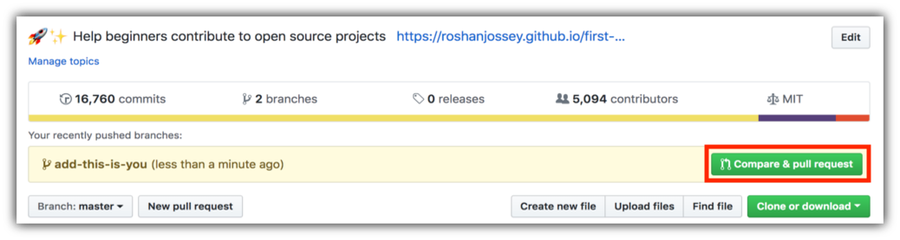

# Versionsverwaltung der Zukunft: Beispiele mit git

## 1. Installation und Einrichtung

### Installation der Programme

Als erstes muss _git_ installiert werden. Dafür müssen die Download-Files von https://git-scm.com/download/win heruntergeladen werden.
Dieser Link führt zum Download für die Windows Version von _git_.

Um nun _git_ zu installieren muss man die gerade heruntergeladene .exe Datei ausführen. Nun erscheint ein Dialogfenster, das Optionen zur Installation von _git_ enthält. Die Voreinstellungen passen so wie sie sind, d.h. es kann einfach durch geklickt werden.

Außerdem braucht man einen Code-Editor. Im folgenden wird Visual Studio Code genutzt. In diesem Tutorial ist leider keine Zeit für eine vollständige Einführung in VS-Code. Hier ist ein Video, das trotzdem nützlich sein könnte 😉 https://www.youtube.com/watch?v=r5jNl-IOSZg

### Anmeldung bei gitHub oder gitLab

Um mit _git_ Repositories/Projekte zu verwalten braucht man Repositories. Hierfür muss ein gitHub oder gitLab Account erstellt werden. Beide Websites funktionieren gut. GitHub ist jedoch die größere Plattform, deshalb gibt es dort mehr Projekt von Anderen.

Für die Registrierung bitte diesem Link folgen: https://github.com (Nutzerdaten merken!!!)

### Einrichtung Username & E-Mail

Um das _git_ des Computers mit gitHub zu verbinden, muss die _.gitconfig-Datei_ bearbeitet werden. Dies geschiet mit dem Befehl _git config_.

```
# Befehl zum setzten des Nutzernamen
$ git config --global user.name hanshuber

# Befehl zum setzen der E-Mail
$ git config --global user.email hans.huber@gmail.com
```

Die ersten Schritte sind geschafft 😁 _git_ ist jetzt berteit für das erste Projekt. Aber welche Befehle werden wie eingesetzt? Das kommt im folgenden Abschnitt.

## 2. Grundlegende Begriffe und Befehle + erstes Projekt

Um die Grundlegenden Begriffe und Befehle zu lernen, kann man an einem Projekt namens _first-contributions_ teilnehmen. Hier werden die Grundlagen vermittelt, die das Zusammenarbeiten von Programmierern aus der ganzen Welt ermöglichen.

Der Link für dieses Projekt lautet: https://github.com/firstcontributions/first-contributions/tree/main

### Repositories _"forken"_

Als erstes muss man das Repository _"forken"_, damit Änderungen daran vorgenommen werden können. Hierzu muss auf den Button namens Fork geklickt werden.


Als nächstes auf Create Fork klicken (alle anderen Einstellungen passen so wie sie sind). Dies sollte nun eine Kopie des Repositorys im persöhnlichen Account erstellen.


### das Projekt auf den eigenen Computer laden (_git clone_)

Jetzt wird das vorher _"geforkte"_ Repository auf den Computer _geklont_. Dazu öffnet man das Repository in seinem Account und klickt auf den Button "Code".


Nun öffnet sich ein Fenster mit einer URL. Diese muss kopiert werden.


Um das Repositroy zu klonen gibt man jetzt den Befehl _git clone_ gefolgt von der gerade kopierten URL.

Dieser Befehl muss in _Commandline_ oder _Cmd_ eingegeben werden (Cmd öffnet sich in VS-Code mit Strg + Ö)

```
# git clone "URL für Repository"
$ git clone https://github.com/firstcontributions/first-contributions.git
```

### Erstellung eines Branch (_git switch -c_)

Bei der Verwendung von _git_ erstellt man für jedes neue Feature einen Branch, den man danach wieder in den Branch _main_ einbettet.

Um einen Branch zu erstellen wird der Befehl _git switch_ verwendet. Jedoch muss man sich dafür mit der _Commandline_ innerhalb des Repositorys befinden.

```
# cd "Ordner wohin man möchte"
$ cd first-contributions
```

Hans befindet sich im richtigen Ordner, da der Pfad den Namen seines Repositroys enthält.

```
C:\Users\hans\Dokumente\first-contributions>
```

Um einen Branch zu erstellen benötigt man einen sinnvollen Namen. Dieser sollte das Feature beschreiben, das man umsetzen will.

```
# git switch -c "Branchname"
$ git switch -c added_Hans_Peter
```

Das "-c" steht hierfür "create". Das heißt, falls man zwischen mehreren Branches wechseln will, ohne einen neuen zu erstellen, lässt man "-c" weg.

Um zu sehen in welchem Branch man sich befindet, nutzt man den Befehl _git branch_. Hierbei gibt es auch die Optionen -r oder -a (-r zeigt remote Repositories und -a zeigt lokale & remote Repositories)

```
$ git branch
    * added_Hans_Peter
      master
```

Super! Jetzt darf man seinen Namen in die Datei Contributers.md schreiben 😎

### Änderungen speichern (_git status_, _git add_ & _git commit_)

Zum Speichern der Änderungen reicht _Strg + S_ leider nicht.Man benötigt drei Schritte.

1. Die Änderungen müssen mit _git status_ ausgegeben werden.

```
$ git status
    Changes not staged for commit:
      (use "git add/rm <file>..." to update what will be committed)
      (use "git restore <file>..." to discard changes in working directory)
        modified: Contributors.md
```

2. Alle Datein, die gespeochert werden sollen, müssen mit _git add_ zum nächsten "commit" hinzugefügt werden.

```
# git add "Dateiname"
$ git add Contributors.md
```

3- Nun müssen diese Änderungen abgegeben/commited werden. Hierzu wird der Befehl _git commit_ verwendet. Jeder _commit_ muss eine Commit-Message enthalten. Diese wird mit -m hinzugefügt und beschreibt was seit dem letzten commit geändert wurde.

```
# git commit -m "Commit-Message"
$ git commit -m "Add Hans to Contributors list"
```


### Änderungen hochladen/pushen (_git push_)

Alle Änderungen, die bis jetzt vorgenommen wurden, waren local. Um nun das Projekt online zu sichern muss es auf gitHub hochgeladen/gepusht werden. Dafür wird der Befehl _git push_ verwendet.

```
# git push origin "Branchname"
$ git push origin added_Hans_Peter
```

Origin beschreibt hier, dass der Branch zu einem Online-Repository gehört.

### Projekt in das Orginal-Projekt integrieren (_pull request_)

Jetzt, da alle Änderungen vorgenommen wurden, kann das Projekt wieder in das Orginal-Projekt integriert werden. Hierzu navigiert man auf gitHub zurück zu seinem Projekt und erstellt eine sogenannte _pull request_.



Nun öffnet sich ein Fenster indem man den Namen seiner _pull request_ und einen Kommentar eingibt. Beides sollte definieren was mit dieser _pull request_ erreichent werden soll.


Der Verwalter des Original-Projekts muss nun die _pull request_ annehmen. Nachdem er diese annimmt wird der Text, den man vorhin eingetragen hat, in _Contributors.md_ angezeigt.

Das erste Projekt ist nun geschafft 😊

## 3. nützliches Wissen

### Integration in VS-Code

In VS-Code kann man auch ohne _Cmd_ Änderungen _adden, commiten und pushen_. Im Fenster _Source Control_ wird mit dem Plus-Symbol sozusagen der Befehl _git add_ ausgeführt. Mit dem Commit-Button können dann alle so hinzugefügten Änderungen _commited_ werden. Nachdem alles so gespeichert wurde kann mit _Sync all Changes_ das Online-Repository auf den neusten Stand gebracht werden.

### Wiederherstellung einer bestimmten Version des Projekts

Die Wiederherstellung einer früheren Version des Projekts kann ganz einfach mit der Erweiterung _gitLense für VS-Code_ erreicht werden.

Nach der Installation sollte ein neues Icon in der rechten Leiste erscheinen, welches bei klick ein neues Fenster in der rechten Spalte öffnet. Hier kann man den Reiter Commit-Graph wählen, welches wieder ein Fenster aufmacht in dem alle _Commits_ gezeigt werden. Nun wählt man lediglich den Commit, den man betrachten möchte, aus und klickt auf die drei Punkte. In einem neu geöffneten Fenster wählt man _Switch to Commit_ um mit dem _HEAD_ (der Stand der in VS-Code angezeigt wird) in diesen Commit zu wechseln.


Um nun das Projekt auf diesen Stand zurück zusetzten, wählt man wieder die drei Punkte, aber jetzt anstelle von _Switch to Commit_ _Rebase to Commit_. Dies setzt den aktuellen Branch auf den Stand dieses Commits.


### Mergen von zwei Branches mit einem diff-Tool

Um VS-Code als diff-Tool zu verwenden muss man die .gitconfig Datei bearbeiten.

```
# Befehl um .gitconfig aufzurufen
$ git config --global -e
```

Dazu müssen in diese Datei folgende Zeilen Code hinzugefügt werden:

```
[diff]
  tool = vscode
[difftool "vscode"]
  cmd = code --wait --diff $LOCAL $REMOTE
[merge]
  tool = vscode
[mergetool "vscode"]
  cmd = code --wait $MERGED
```

Jetzt kann man zwei Branches _mergen_ in dem man mit _git switch_ zu dem Branch navigiert, in den der andere Branch hinein gemerged werden soll. Als nächstes kann mit _Strg + Shift + P_ nach dem Command _"Git: Merge Branch"_ suchen. Nun muss lediglich der zweite Branch ausgewählt werden..

Falls während einem Merge Widersprüche auftreten, können diese nun mit dem in VS-Code eingebauten _diff-Tool_ gelöst werden. Mit diesem Tool kann gewählt werden, welche Version des Codes verwendet werden soll.

### nicht alles Hochladen -> .gitignore

Mit einer .gitignore Datei können bestimmte Datein ausgewählt werden, die _git_ nicht tracken soll und somit auch nicht bei _Commits_ hochladen soll. Dies sind Dateien, die nicht für die Öffentlichkeit bestimmt sind und auch nicht auf gitHub landen sollten. Ein Beispiel für solche Datein wären Dateien, die SSH-Keys (sind für jede Person unteschiedlich) enthalten.

Ein Beispiel für eine .gitignore Datei wäre:

```
# Logs
logs
*.log
npm-debug.log*
yarn-debug.log*
yarn-error.log*
pnpm-debug.log*
lerna-debug.log*

node_modules
dist
dist-ssr
*.local

# Editor directories and files
.vscode/*
!.vscode/extensions.json
.idea
.DS_Store
*.suo
*.ntvs*
*.njsproj
*.sln
*.sw?
```

# Deploying a Website to GitHub Pages

## Introduction

In this tutorial, I'll show you how you can create a website and deploy it to GitHub Pages.

To deploy the website, I'll be using the package [`gh-pages`](https://github.com/tschaub/gh-pages), which is an npm package people can use to deploy things to [GitHub Pages](https://docs.github.com/en/pages/getting-started-with-github-pages/about-github-pages), a free web hosting service provided by GitHub.

If you follow along with this tutorial, you'll end up with a new website hosted on GitHub Pages, which you can then customize.

## Tutorial

### Prerequisites

1. [Node and npm](https://nodejs.org/en/download/) are installed. Here are the versions I'll be using while making this tutorial:

   ```shell
   $ node --version
   v20.11.0

   $ npm --version
   10.2.4
   ```

   > Installing npm adds two commands to the system - `npm` and `npx` - only `npm` will be used in this tutorial.

2. [Git](https://git-scm.com/book/en/v2/Getting-Started-Installing-Git) is installed. Here's the version I'll be using while making this tutorial:

   ```shell
   $ git --version
   git version 2.43.0.windows.1
   ```

3. A [GitHub](https://github.com/signup) account. :octocat:

4. A project folder that contains your website. (the project doesn't need to be uploaded to gitHub yet)

### Procedure

#### 1. Setup the repository

1. Branch names: `master` vs. `main`

   > The Git repository will have one branch, which will be named either (a) `master`, the default for a fresh Git installation; or (b) the value of the Git configuration variable, `init.defaultBranch`, if your computer is running Git version 2.28 or later _and_ you have [set that variable](https://github.blog/2020-07-27-highlights-from-git-2-28/#introducing-init-defaultbranch) in your Git configuration (e.g. via `$ git config --global init.defaultBranch main`).
   >
   > Since I have not set that variable in my Git installation, the branch in my repository will be named `master`. In case the branch in your repository has a different name (which you can check by running `$ git branch`), such as `main`; you can **replace** all occurrences of `master` throughout the remainder of this tutorial, with that other name (e.g. `master` → `main`).

2. Enter the your project folder:

   ```shell
   $ cd my-website
   ```

3. Initialize your project as a git repository

   ```shell
   $ git init
   ```

At this point, there is a website on your computer and you are in the folder that contains its source code. All of the remaining commands shown in this tutorial can be run from that folder.

#### 2. Install the `gh-pages` npm package

1. Install the [`gh-pages`](https://github.com/tschaub/gh-pages) npm package and designate it as a [development dependency](https://docs.npmjs.com/specifying-dependencies-and-devdependencies-in-a-package-json-file):

   ```shell
   $ npm install gh-pages --save-dev
   ```

At this point, the `gh-pages` npm package is installed on your computer and the website's dependence upon it is documented in the website's `package.json` file.

#### 3. Add a `homepage` property to the `package.json` file

1.  Open your text editor and then the `package.json` file.

    ```shell
    $ code .
    ```

    > In this tutorial, the text editor I'll be using is [Visual Studio Code](https://code.visualstudio.com/). You can use any text editor you want; for example, [vi](https://www.vim.org/).

2.  Add a `homepage` property in this format: `https://{username}.github.io/{repo-name}`

    > For a [project site](https://pages.github.com/#project-site), that's the format. For a [user site](https://pages.github.com/#user-site), the format is: `https://{username}.github.io`. You can read more about the `homepage` property in the ["GitHub Pages" section](https://create-react-app.dev/docs/deployment/#github-pages) of the `create-react-app` documentation.

        ```diff
        {
          "name": "my-app",
          "version": "0.1.0",
        + "homepage": "https://gitname.github.io/react-gh-pages",
          "private": true,
        ```

    At this point, the website's `package.json` file includes a property named `homepage`.

#### 4. Add deployment scripts to the `package.json` file

1. Open the `package.json` file in a text editor (if it isn't already open in one).

2. Add a `predeploy` property and a `deploy` property to the `scripts` object:

   ```diff
   "scripts": {
   +   "predeploy": "npm run build",
   +   "deploy": "gh-pages -d build",
       "start": "react-scripts start",
       "build": "react-scripts build",
   ```

At this point, the website's `package.json` file includes deployment scripts.

#### 5. Add a "remote" that points to the GitHub repository

1. Add a "[remote](https://git-scm.com/docs/git-remote)" to the local Git repository.

   You can do that by issuing a command in this format:

   ```shell
   $ git remote add origin https://github.com/{username}/{repo-name}.git
   ```

   To customize that command for your situation, replace `{username}` with your GitHub username and replace `{repo-name}` with the name of the GitHub repository you created in Step 1.

   In my case, I'll run:

   ```shell
   $ git remote add origin https://github.com/gitname/react-gh-pages.git
   ```

   > That command tells Git where I want it to push things whenever I—or the `gh-pages` npm package acting on my behalf—issue the `$ git push` command from within this local Git repository.

At this point, the local repository has a "remote" whose URL points to the GitHub repository you created in Step 1.

#### 6. Push the website to the GitHub repository

1. Push the website to the GitHub repository

   ```shell
   $ npm run deploy
   ```

   > That will cause the `predeploy` and `deploy` scripts defined in `package.json` to run.
   >
   > Under the hood, the `predeploy` script will build a distributable version of the React app and store it in a folder named `build`. Then, the `deploy` script will push the contents of that folder to a new commit on the `gh-pages` branch of the GitHub repository, creating that branch if it doesn't already exist.

   > By default, the new commit on the `gh-pages` branch will have a commit message of "Updates". You can [specify a custom commit message](https://github.com/gitname/react-gh-pages/issues/80#issuecomment-1042449820) via the `-m` option, like this:
   >
   > ```shell
   > $ npm run deploy -- -m "Deploy website to GitHub Pages"
   > ```

At this point, the GitHub repository contains a branch named `gh-pages`, which contains the files that make up the distributable version of the website. However, we haven't configured GitHub Pages to _serve_ those files yet.

#### 7. Configure GitHub Pages

1. Navigate to the **GitHub Pages** settings page
   1. In your web browser, navigate to the GitHub repository
   1. Above the code browser, click on the tab labeled "Settings"
   1. In the sidebar, in the "Code and automation" section, click on "Pages"
1. Configure the "Build and deployment" settings like this:
   1. **Source**: Deploy from a branch
   2. **Branch**:
      - Branch: `gh-pages`
      - Folder: `/ (root)`
1. Click on the "Save" button

**That's it!** The website has been deployed to GitHub Pages! :rocket:

At this point, the website is accessible to anyone who visits the `homepage` URL you specified in Step 3. For example, the website I deployed would be accessible at https://gitname.github.io/react-gh-pages.

#### 8. (Optional) Store the website's _source code_ on GitHub

In a previous step, the `gh-pages` npm package pushed the distributable version of the website to a branch named `gh-pages` in the GitHub repository. However, the _source code_ of the website is not yet stored on GitHub.

In this step, I'll show you how you can store the source code of the React app on GitHub.

1. Commit the changes you made while you were following this tutorial, to the `master` branch of the local Git repository; then, push that branch up to the `master` branch of the GitHub repository.

   ```shell
   $ git add .
   $ git commit -m "Configure React app for deployment to GitHub Pages"
   $ git push origin master
   ```

   > I recommend exploring the GitHub repository at this point. It will have two branches: `master` and `gh-pages`. The `master` branch will contain the website's source code, while the `gh-pages` branch will contain the distributable version of the website.

#### 9. (Optional) Configure build folder in diffrent frameworks

The `npm build` command sometimes creates a build folder called `dist` (when using specific frameworks), however the `gh-pages` package needs this folder to be called `build`. You can configure the name of this folder in the `config.js` file of the framework. The framework I use is called `vite` so the config file is called `vite.config.js` (sometimes this file won't exist yet => just create it the file). Now copy the following code into this file.

```
export default {
	// config options
	base: '',
	build: {
		outDir: 'build', // output directory here
	},
};
```

## References

1. [The tutoial this that inspired this one](https://create-react-app.dev/docs/deployment/#github-pages)
2. [GitHub blog: Build and deploy GitHub Pages from any branch](https://github.blog/changelog/2020-09-03-build-and-deploy-github-pages-from-any-branch/)
3. [Preserving the `CNAME` file when using a custom domain](https://github.com/gitname/react-gh-pages/issues/89#issuecomment-1207271670)
